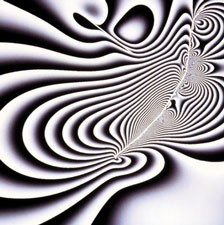
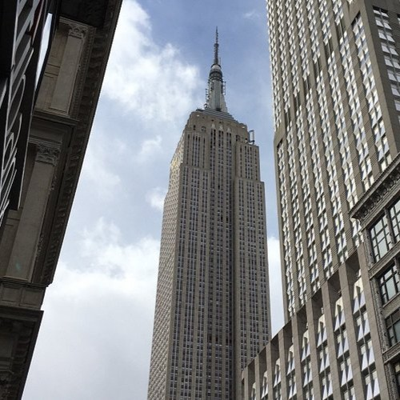
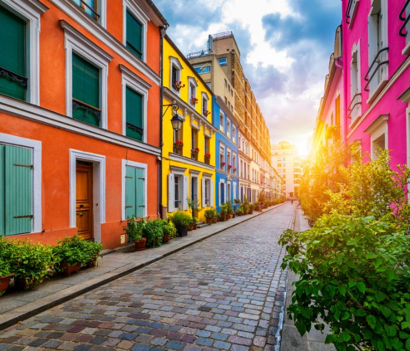

# 2D Image AI upscaler using multi resolution hash grids

## Description
Initially inteded as a building block for a pipeline similar to instant NGP, it became an image reconstructor that has the option to upscale images.

## Setup

### HashGrid2D 
__When initialized 3 parameters can be passed: `hash_size`, `cell_size`, `dimensions`.__  
  
`hash_size` dictates the number of entries a given hash grid can have. The total number is 2^`hash_size`  
  
`cell_size` represents how much space a given entry occupies in a 2D space. If cell_size = 1 then it occupies 1 pixel. This can be adjusted to capture finer and coarser details from an image.  
  
`dimensions` is the size of each feature vector from the table e.g. for 2D a feature vector can be [0.15912, -0.2332]  

The `hash` function prevents collision while keeping the entries as sparse as possible.  

`batch_lookup` essentially finds entries in the grid based on a set of coordinates.

### MultiResHG2D 
  
The given `layout` in the constructor determines the shape of the hash grid. It takes a list of tuples of the form [(int, float, int)]. 

__Layout__  
The layout which I found to be most stable (i.e. lightweight and pretty accurate) is this [(14, 8.0, 4), (16, 2.0, 8), (18, 0.5, 8)].  
It is also the default option when running the __Trainer__.  
It consists of:  
1. A 4D hash grid that learns 8x8 squares of pixels. It captures broader details while keeping memory usage low.  
2. A 8D grid that captures 2x2 squares that captures finer details.  
3. A 8D grid that blends colors between pixels, essentially learning how to sharpen the image while preserving the structure.

Dependng on usage, other layouts might be more efficient. For example, while training with the gradient picture `gradient.jpeg`, I found a (14, 4.0, 4) to be most efficient.

__Adjustments__  
During training I noticed that some levels would dominate over the others so I used softmax to stabilize them. 

### MLP
  
Consists of a basic 3 layer mlp with as many inputs as the sum of dimensions in the hash grid layout, 64 neurons in the hidden layer and 4 in the output layer (initially designed  
produce density as an output for 3D images but dropped it later on due to computational limitations).  
  
  
### Trainer  

This is where the trainer is assembled. The constructor takes the `path` to a given file, `batch_size` (how many hash grid entries are computed before the loss is calculated)  
and the layout described above. Here the grid, mlp, learning rate and optimizer are initialized. The image is also split into batches so that it can be fed into the mlp.  

The `train(epoch)` method essentially feeds each batch into the mlp, computes loss, and uses the optimzer to update the weights of the mlp.  
It is important to note that if a cuda device is detected, it will atempt to use float16 precission which does not perform best with RTX 20 GPUs or lower.  
For that I recommend float32 to ensure accuracy with the model.  
  
  
The `reconstruct_image(samples,save_path)` essentialy takes values from the hash grid and approximates them into (R,G,B) by denormalizing them from [0,1] to [0,255]. The image is 
stretched based on the sample size and reconstructed using bicubic interpolation. If a `path` is passed then it is saved, otheriwse just displayed as pyplot.  

### CUI  
  

This is a basic implementation of a console interface with 4 options. It walks you trough all the neccessary initializations for the `Trainer` and gives the option to train on an image for a given number of epochs. The image can be displayed or saved.

## Results  

### Images  

  Below is a list of images used for training. 
  
1.   
128x128  
2.   
258x258  
3.   
500x500  
4.   
700x600
  
### Performance

  Below is the image generated after running the trainer with the specified settings all after `1000 epochs`.

1.  `Layout`  [(14, 8.0, 4), (16, 2.0, 8), (18, 0.5, 8)]  
    `Batch size`  256  
    `Completion time`  213.67 seconds  
    `Sampling`  4x  
  
2.  `Layout`  [(14, 8.0, 4), (16, 2.0, 8), (18, 0.5, 8), (18, 0.125, 4)]  
    `Batch size`  512  
    `Completion time`  213.67 seconds  
    `Sampling`  4x  

3.  `Layout`  [(14, 8.0, 4), (16, 2.0, 8), (18, 0.5, 8), (18, 0.125, 4)]  
    `Batch size`  512  
    `Completion time`  213.67 seconds  
    `Sampling`  4x  

4.  `Layout`  [(14, 8.0, 4), (16, 2.0, 8), (18, 0.5, 8), (18, 0.125, 4)]  
    `Batch size`  1024  
    `Completion time`  213.67 seconds  
    `Sampling`  4x  
